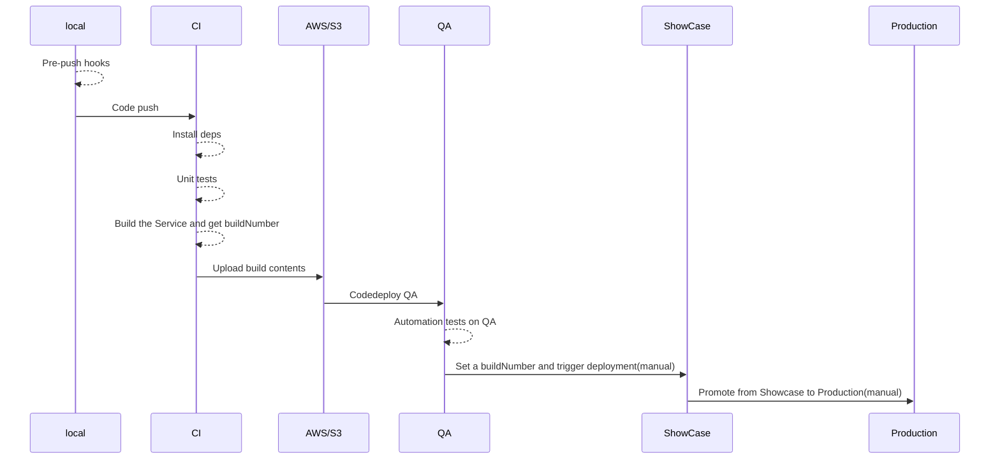

# GDHI-Backend

[](https://github.com/healthenabled/gdhi-service-version2/actions/workflows/build.yml)

**DB Setup using Postgres Container running in Docker**

1. Pull docker image for postgres
```
    docker pull postgres
```
2.  Check if the postgres image is pulled in
```
    docker image ls 
```
3. Run the postgres container 
```
    docker run -dit -e POSTGRES_USER=gdhi -e POSTGRES_PASSWORD=password -p 5432:5432 --name gdhi postgres
```
4. Create user and database using Postgres GUI client (for e.g., pgAdmin4, dbeaver)
```
    CREATE USER gdhi WITH PASSWORD 'password';
    CREATE DATABASE gdhi OWNER gdhi;
```
5. Install uuid extension

connect to DB gdhi
```
    create extension if not exists "uuid-ossp";
```

6. Execute `sh ./utils/set-up-git-hooks.sh` from base folder to validate commit message format.

7. Upon the server start, hit the following endpoint to populate the country overall phase (Only for Published Countries.)

```
   localhost:8080/api/admin/countries/calculate_phase
```
**To Run**

1. Run by executing
`./gradlew clean bootRun`

**INTEGRATION TESTS**
1. Create Test user and database
```
    CREATE USER gdhi_test WITH PASSWORD 'testpassword';
    CREATE DATABASE gdhi_test OWNER gdhi_test;
```
2. Install uuid extension

connect to DB gdhi_test
```
    create extension if not exists "uuid-ossp";
```

#### Code Style

To ensure your Intellij code style matches the checkstyle in the gradle build.
1. Download the code style from the [Contracts Repository](https://github.com/healthenabled/contracts.git)
2. Go to **preferences** -> **code style** -> **java**
3. Click on the settings icon, next to the project
4. Click on the Import Schema -> Intellij IDEA style XML
5. Select the downloaded file
6. The style is updated, use the Reformat the code using (⌘ ⌥ L).

## Deployment
- We have 3 `environments` of Deployment:
  - [QA](https://github.com/healthenabled/gdhi-service-version2/deployments/activity_log?environment=QA)
  - [Showcase](https://github.com/healthenabled/gdhi-service-version2/deployments/activity_log?environment=SHOWCASE) 
  - [Production](https://github.com/healthenabled/gdhi-service-version2/deployments/activity_log?environment=PROD)
- We use `github actions` to configure our CI. The code for the same can be found in [`.github/workflows`](https://github.com/healthenabled/gdhi-service-version2/tree/main/.github/workflows) directory. 
- Below is a sequence diagram for CI/CD of the application:



