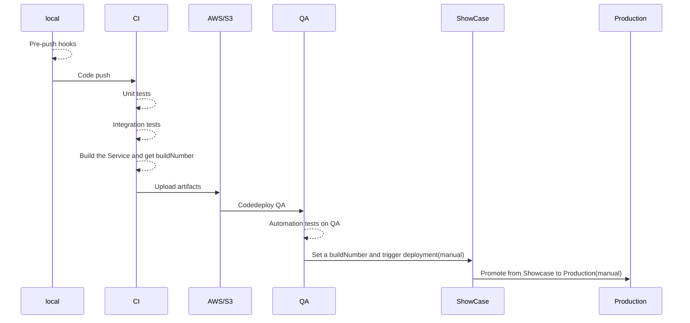

# GDHI-Backend

[](https://github.com/healthenabled/gdhi-service-version2/actions/workflows/build.yml)

This is a Spring Boot application built using Gradle. Works well with Java 17 or newer.

## Table of Contents

1. **[Pre-requisites](#pre-requisites)**
2. **[Setup DB](#setup-db)** 
3. **[Pre-Commit Hooks](#pre-commit-hooks)**
4. **[Local Setup](#local-setup)**
5. **[AI Integration - Amazon Bedrock](#ai-integration---amazon-bedrock)**
6. **[Gradle Tasks](#gradle-tasks)**
7. **[Setup Test Environment](#setup-test-environment)**
8. **[Project Overview](#project-overview)**
9. **[Code Style](#code-style)**
10. **[Deployment](#Deployment)**
11. **[Troubleshooting](#Troubleshooting)**

## Pre-requisites
- Install Java
- Setup DB

## Setup DB

1. Pull docker image for postgres
```
    docker pull postgres
```
2.  Check if the postgres image is pulled in
```
    docker image ls 
```
3. Run the postgres container 
```
    docker run -dit -e POSTGRES_USER=gdhi -e POSTGRES_PASSWORD=password -p 5432:5432 --name gdhi postgres
```
4. Create user and database using Postgres GUI client (for e.g., pgAdmin4, dbeaver)
```
    CREATE USER gdhi WITH PASSWORD 'password';
    CREATE DATABASE gdhi OWNER gdhi;
```
5. Install uuid extension
```
    create extension if not exists "uuid-ossp";
```
## Pre-Commit Hooks

- Execute `sh ./utils/set-up-git-hooks.sh` from base folder to validate commit message format.

## Local Setup 
- Upon the server start, hit the following endpoint to populate the country overall phase (Only for Published Countries.)

```
   localhost:8080/api/admin/countries/calculate_phase
```

## AI Integration - Amazon Bedrock

The backend includes a simple streaming AI chat integration backed by
[Amazon Bedrock Agents](https://docs.aws.amazon.com/bedrock/latest/userguide/agents.html). The service does not call
foundation models directly. It invokes a configured Bedrock Agent through the AWS SDK, streams the response back to the
client, and handles Bedrock Return Control tool calls inside this Spring Boot application.

### Runtime flow

1. The client sends a chat request to `POST /ai/stream`.
2. `AiController` forwards the request to `GdhmAiService`.
3. `GdhmAiService` resolves the session id from `responseId`, or creates a new UUID when it is missing.
4. The requested `user_language` selects a language-specific Bedrock agent from `aws.bedrock.agents`. If a language
   agent is not configured, the service falls back to the English agent.
5. The service invokes Bedrock Agent Runtime with `BedrockAgentRuntimeAsyncClient`, `streamFinalResponse(true)`,
   trace support, and the configured guardrail interval.
6. If Bedrock returns normal response chunks, the API streams those chunks to the client as `text/event-stream`.
7. If Bedrock returns control for an action group, `BedrockReturnControlService` executes the requested GDHM data tool
   through `BedrockToolsService`, sends the tool result back to Bedrock, and continues the same agent session.

The main implementation classes are:

- `src/main/java/it/gdhi/controller/AiController.java`
- `src/main/java/it/gdhi/service/GdhmAiService.java`
- `src/main/java/it/gdhi/service/BedrockReturnControlService.java`
- `src/main/java/it/gdhi/service/BedrockToolsService.java`
- `src/main/java/it/gdhi/config/BedrockConfig.java`
- `src/main/java/it/gdhi/config/BedrockAgentProperties.java`

### API contract

Local request example:

```bash
curl -N -X POST http://localhost:8888/ai/stream \
  -H "Content-Type: application/json" \
  -d '{
    "query": "Which countries improved their GDHM phase most recently?",
    "user_language": "en"
  }'
```

Request body:

| Field | Required | Notes |
| --- | --- | --- |
| `query` | Yes | User question. The current DTO validates this as non-blank with a maximum of 2000 characters. |
| `user_language` | No | Language code used for agent routing and response language. Current configured keys are `en`, `es`, `ar`, `pt`, and `fr`. Defaults to `en`. |
| `responseId` | No | Conversation/session id. Reuse it to continue a Bedrock agent session. If omitted, the backend creates a UUID. |

The endpoint produces `text/event-stream`, so clients should consume it as a stream rather than waiting for a single JSON
response.

### Application configuration

`application.yml` binds the Bedrock settings under `aws`:

```yaml
aws:
  region: ${AWS_REGION}
  bedrock:
    agentId: ${AWS_BEDROCK_AGENT_ID:}
    agentAliasId: ${AWS_BEDROCK_AGENT_ALIAS_ID:}
    agents:
      en:
        agentId: ${AWS_BEDROCK_EN_AGENT_ID:${AWS_BEDROCK_AGENT_ID:}}
        agentAliasId: ${AWS_BEDROCK_EN_AGENT_ALIAS_ID:${AWS_BEDROCK_AGENT_ALIAS_ID:}}
      es:
        agentId: ${AWS_BEDROCK_ES_AGENT_ID:}
        agentAliasId: ${AWS_BEDROCK_ES_AGENT_ALIAS_ID:}
      ar:
        agentId: ${AWS_BEDROCK_AR_AGENT_ID:}
        agentAliasId: ${AWS_BEDROCK_AR_AGENT_ALIAS_ID:}
      pt:
        agentId: ${AWS_BEDROCK_PT_AGENT_ID:}
        agentAliasId: ${AWS_BEDROCK_PT_AGENT_ALIAS_ID:}
      fr:
        agentId: ${AWS_BEDROCK_FR_AGENT_ID:}
        agentAliasId: ${AWS_BEDROCK_FR_AGENT_ALIAS_ID:}
```

Minimum local environment for one English agent:

```bash
export AWS_REGION=us-east-1
export AWS_PROFILE=gdhi-dev
export AWS_BEDROCK_AGENT_ID=AGENT12345
export AWS_BEDROCK_AGENT_ALIAS_ID=ALIAS12345
./gradlew bootRun
```

For production, prefer an instance/task role or another short-lived AWS credential source. `BedrockConfig` uses the AWS
SDK for Java 2.x `DefaultCredentialsProvider`, so credentials can come from environment variables, Java system
properties, web identity, shared AWS profile files, ECS task roles, EC2 instance profiles, and other standard SDK
locations. Do not commit AWS access keys or Bedrock agent ids that belong only to a private environment.

Optional Bedrock properties can be overridden through Spring configuration:

| Property | Default | Notes |
| --- | --- | --- |
| `aws.bedrock.maxModelRetryAttempts` | `2` | Retries initial `DependencyFailedException` failures before any text or tool result has been emitted. |
| `aws.bedrock.enableTrace` | `true` | Sends `enableTrace=true` to Bedrock and logs trace summaries. |
| `aws.bedrock.applyGuardrailInterval` | `20` | Passed to Bedrock streaming configuration. |
| `aws.bedrock.logFullTrace` | `false` | Logs complete Bedrock trace payloads. Keep disabled unless actively debugging because traces can be verbose. |

### AWS Bedrock setup checklist

1. Choose an AWS Region where Amazon Bedrock Agents and the selected foundation model are available.
2. Confirm model access in the Bedrock console. Current AWS behavior enables many models automatically when the account
   has the correct AWS Marketplace permissions, but provider-specific prerequisites may still apply. For example,
   Anthropic models can require a first-time use form before production invocation.
3. Create or select an Amazon Bedrock Agent. Give it clear instructions for answering GDHM questions, respecting the
   requested response language, asking for missing filters when needed, and using tools for live GDHM data instead of
   guessing.
4. Configure the agent service role. The role needs permission to invoke the selected foundation model. If streaming is
   enabled, include `bedrock:InvokeModelWithResponseStream` for the model used by the agent. Add S3 permissions if the
   action group schema is stored in S3. Add guardrail permissions if the agent is associated with a guardrail.
5. Add a Return Control action group, for example named `GDHI`. This application expects Bedrock to return the action
   request to the caller; it does not expose a Lambda action group handler.
6. Define the action group API schema. Use OpenAPI JSON or YAML in the Bedrock console, or store it in S3 and reference
   it from the action group. Each operation must use `GET` and the exact paths listed in the tool contract below.
7. Save and prepare the agent after changing instructions or action groups.
8. Create an alias for the prepared agent. The backend needs both the agent id and alias id.
9. Attach application runtime IAM permissions for `bedrock:InvokeAgent` on the agent alias ARNs used by this service.

Example least-privilege runtime policy for the backend role:

```json
{
  "Version": "2012-10-17",
  "Statement": [
    {
      "Sid": "InvokeGdhiBedrockAgents",
      "Effect": "Allow",
      "Action": "bedrock:InvokeAgent",
      "Resource": [
        "arn:aws:bedrock:${AWS_REGION}:${AWS_ACCOUNT_ID}:agent-alias/${AWS_BEDROCK_EN_AGENT_ID}/${AWS_BEDROCK_EN_AGENT_ALIAS_ID}",
        "arn:aws:bedrock:${AWS_REGION}:${AWS_ACCOUNT_ID}:agent-alias/${AWS_BEDROCK_ES_AGENT_ID}/${AWS_BEDROCK_ES_AGENT_ALIAS_ID}",
        "arn:aws:bedrock:${AWS_REGION}:${AWS_ACCOUNT_ID}:agent-alias/${AWS_BEDROCK_AR_AGENT_ID}/${AWS_BEDROCK_AR_AGENT_ALIAS_ID}",
        "arn:aws:bedrock:${AWS_REGION}:${AWS_ACCOUNT_ID}:agent-alias/${AWS_BEDROCK_PT_AGENT_ID}/${AWS_BEDROCK_PT_AGENT_ALIAS_ID}",
        "arn:aws:bedrock:${AWS_REGION}:${AWS_ACCOUNT_ID}:agent-alias/${AWS_BEDROCK_FR_AGENT_ID}/${AWS_BEDROCK_FR_AGENT_ALIAS_ID}"
      ]
    }
  ]
}
```

If an environment only configures one English agent, scope the policy to that one alias.

### Bedrock Return Control tool contract

`BedrockToolsService` executes action group requests returned by Bedrock. The contract is intentionally read-only:
unsupported HTTP methods are rejected, and all exposed operations are `GET`.

| Method and path | Purpose | Important parameters |
| --- | --- | --- |
| `GET /countries` | List countries. | Optional `user_language`. |
| `GET /countries/{id}/summary` | Fetch a country summary without personal contact details. | Required `id`; optional `year`, `user_language`. |
| `GET /countries/{id}/phase` | Fetch a country overall phase. | Required `id`; optional `year`, `user_language`. |
| `GET /countries/{id}/health-indicators` | Fetch country health indicator scores. | Required `id`; optional `year`, `user_language`. |
| `GET /countries-by-phase` | List countries in an overall phase. | Required `phase`; optional `year`, `user_language`. |
| `GET /global-health-indicators` | Fetch global or regional health indicator data. | At least one of `categoryId`, `phase`, or `regionId`; optional `year`, `user_language`. |
| `GET /countries-health-indicator-scores` | Compare countries for a category or phase. | At least one of `categoryId` or `phase`; optional `year`, `user_language`. |
| `GET /regions` | List regions. | Optional `user_language`. |
| `GET /regions/{id}/countries` | Fetch region country data for selected years. | Required `id`, `list_of_years`; optional `user_language`. |
| `GET /regions/{id}/years` | List years available for a region. | Required `id`; optional `limit`. |
| `GET /metadata/health-indicator-options` | Fetch category and health indicator metadata. | Optional `user_language`. |
| `GET /metadata/phases` | Fetch phase metadata. | None. |
| `GET /metadata/years` | Fetch available years. | None. |
| `GET /analytics/country-phase-trends` | Analyze country phase movement over time. | Optional `regionId`, `countryId`, `categoryId`, `indicatorId`, `startYear`, `endYear`, `direction`, `minSubmissionYears`, `limit`. |
| `GET /analytics/country-rankings` | Rank countries by GDHM score filters. | Optional `regionId`, `countryId` or `countryIds`, `categoryId`, `indicatorId`, `year`, `minPhase`, `maxPhase`, `sort`, `limit`, secondary filter fields. |
| `GET /analytics/data-completeness` | Analyze missing data or phase-count completeness. | Required `analysisType`; optional `year`, `regionId`, `phase`, `limit`. |

When adding or changing a tool, update both the Bedrock action group schema and `BedrockToolsService.executeApiInvocation`.
The path, method, and parameter names must match exactly because Bedrock returns those values to the backend.

### Safety, privacy, and operations

- Keep the action group read-only unless there is a reviewed product requirement for write actions.
- Use narrow IAM permissions for the application role and the Bedrock agent service role.
- Use Bedrock Guardrails for production-facing deployments where the assistant may receive unsafe, sensitive, or
  off-topic input.
- Do not include personal contact details in tool responses. The current country summary tool explicitly returns country
  summary data without personal contact details.
- Keep `aws.bedrock.logFullTrace=false` in normal environments. Enable it temporarily only for debugging and review logs
  for sensitive content before sharing.
- Monitor logs for `Bedrock trace`, `Large Bedrock tool response`, `DependencyFailedException`,
  `AccessDeniedException`, throttling, and validation errors.
- Ask users to narrow broad questions by country, year, category, phase, or region when the model or tool response is too
  large to complete reliably.

Useful AWS references:

- [Request access to Amazon Bedrock models](https://docs.aws.amazon.com/bedrock/latest/userguide/model-access.html)
- [Create a service role for Amazon Bedrock Agents](https://docs.aws.amazon.com/bedrock/latest/userguide/agents-permissions.html)
- [Define OpenAPI schemas for Bedrock action groups](https://docs.aws.amazon.com/bedrock/latest/userguide/agents-api-schema.html)
- [Create an alias for a Bedrock Agent](https://docs.aws.amazon.com/bedrock/latest/userguide/deploy-agent-proc.html)
- [Invoke a Bedrock Agent from an application](https://docs.aws.amazon.com/bedrock/latest/userguide/agents-invoke-agent.html)
- [AWS SDK for Java 2.x default credentials provider chain](https://docs.aws.amazon.com/sdk-for-java/latest/developer-guide/credentials-chain.html)
- [Amazon Bedrock data protection](https://docs.aws.amazon.com/bedrock/latest/userguide/data-protection.html)
- [Amazon Bedrock Guardrails](https://docs.aws.amazon.com/bedrock/latest/userguide/guardrails-how.html)

## Gradle Tasks

1. Run by executing
`./gradlew clean bootRun`
2. To run test 
`./gradlew clean build`
3. To build jar file
`./gradlew clean bootjar`

## Setup Test Environment
1. Create Test user and database
```
    CREATE USER gdhi_test WITH PASSWORD 'testpassword';
    CREATE DATABASE gdhi_test OWNER gdhi_test;
```
2. Install uuid extension

connect to DB gdhi_test
```
    create extension if not exists "uuid-ossp";
```
## Project overview
- This is the backend repo for [GDHM](https://monitor.digitalhealthmonitor.org/). 
- The project provides a platform to upload digital health metrices of various Countries globally and a way to visualize them. 
- We have **yearwise** segregation of data to allow comparisons across years.
- We also have **Regions** which are composed of Countries
- We rely on backend as our source of truth and use the UI for only minor data changes before rendering it on the UI

## Code Style

To ensure your Intellij code style matches the checkstyle in the gradle build.
1. Download the code style from the [Contracts Repository](https://github.com/healthenabled/contracts.git)
2. Go to **preferences** -> **code style** -> **java**
3. Click on the settings icon, next to the project
4. Click on the Import Schema -> Intellij IDEA style XML
5. Select the downloaded file
6. The style is updated, use the Reformat the code using (⌘ ⌥ L).

## Deployment

- We have 3 `environments` of Deployment:
  - [QA](https://github.com/healthenabled/gdhi-service-version2/deployments/activity_log?environment=QA)
  - [Showcase](https://github.com/healthenabled/gdhi-service-version2/deployments/activity_log?environment=SHOWCASE) 
  - [Production](https://github.com/healthenabled/gdhi-service-version2/deployments/activity_log?environment=PROD)
- We use `github actions` to configure our CI. The code for the same can be found in [`.github/workflows`](https://github.com/healthenabled/gdhi-service-version2/tree/main/.github/workflows) directory. 
- Below is a sequence diagram for CI/CD of the application:

```mermaid
  sequenceDiagram;
      participant local
      participant CI
      participant AWS/S3
      participant QA
      participant ShowCase
      participant Production
      local-->>local: Pre-push hooks
      local->>CI: Code push
      CI-->>CI: Unit tests
      CI-->>CI: Integration tests
      CI-->>CI: Build the Service and get buildNumber
      CI->>AWS/S3: Upload artifacts
      AWS/S3->>QA: Codedeploy QA
      QA-->>QA: Automation tests on QA
      QA->>ShowCase: Set a buildNumber and trigger deployment(manual)
      ShowCase->>Production: Promote from Showcase to Production(manual)
```

## Troubleshooting

1. Bootrun not working
- Check if local db is setup
- Check if docker container is running 
- Check if there is a migration mismatch in the schema_version table in the public schema
- Check if java version used is compatible with the backend
2. All Integration tests and repository tests failing 
- Check if test db is setup properly
- Check if there is a migration mismatch in the schema_version table in the public schema
3. Port already in use 
- Check if something else is using the port designated to the db
4. Migration script checksum mismatch error
- Delete the record and all record below it in schema_version table
- Rerun bootrun or build

